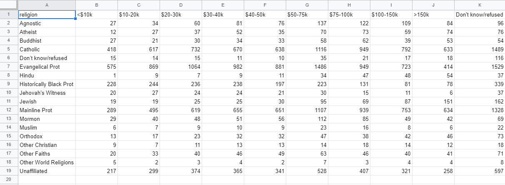
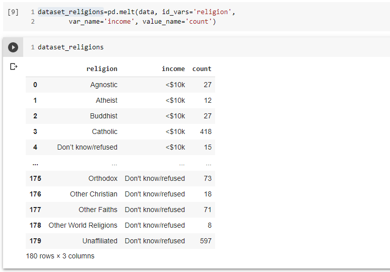

# Tidying Messy Datasets Tutorial

Real datasets may violate the three precepts of tidy data in almost every way
imaginable. While occasionally you do get a dataset that you can start analysing immediately,
this is the exception, not the rule. This tutorial describes the most common problems
with messy datasets and how to fix them:

• Column headers are values, not variable names.
A common type of messy dataset is tabular data designed for presentation, where variables
form both the rows and columns, and column headers are values, not variable names.

Before:

After:

• Multiple variables are stored in one column.
After melting, the column variable names often becomes a combination of multiple underlying
variable names.

• Variables are stored in both rows and columns.
The most complicated form of messy data occurs when variables are stored in both rows and
columns.

• Multiple types of observational units are stored in the same table.
Datasets often involve values collected at multiple levels, on different types of observational
units. During tidying, each type of observational unit should be stored in its own table. This
is closely related to the idea of database normalisation, where each fact is expressed in only
one place. If this is not done, it's possible for inconsistencies to occur.

• A single observational unit is stored in multiple tables.
It's also common to find data values about a single type of observational unit spread out over
multiple tables or files.

# Installation

1. Install anaconda (use the Python 3 version): https://www.continuum.io/downloads
2. See the Software-Carpentry Installations for `bash`, `git`, `python`, and `text editor`:   https://swcarpentry.github.io/workshop-template/#setup

# Reference : 

Journal of Statistical Software
https://vita.had.co.nz/papers/tidy-data.pdf

